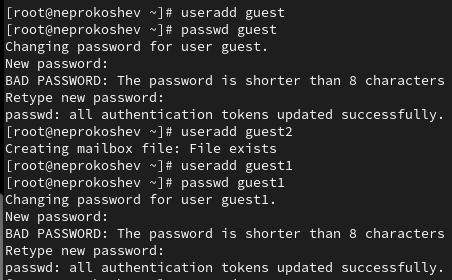
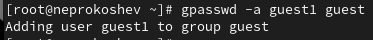
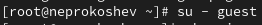
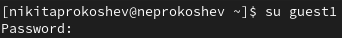
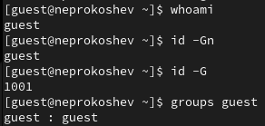
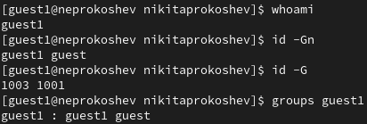
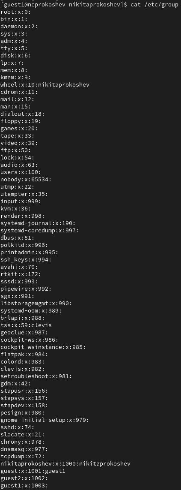
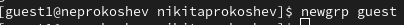
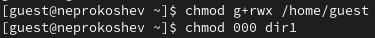

---
## Front matter
lang: ru-RU
title: Презентация Лабораторной работы №3
subtitle: По дисциплине Информационная безопасность
author:
  - Прокошев Н.Е.
institute:
  - Российский университет дружбы народов, Москва, Россия
date: 23 сентября 2023

## i18n babel
babel-lang: russian
babel-otherlangs: english

## Formatting pdf
toc: false
toc-title: Содержание
slide_level: 2
aspectratio: 169
section-titles: true
theme: metropolis
header-includes:
 - '\makeatletter'
 - '\makeatother'
---

# Информация

## Докладчик

:::::::::::::: {.columns align=center}
::: {.column width="70%"}

  * Прокошев Никита Евгеньевич
  * студент НФИбд-02-20
  * Факультет Физико-Математических и Естественных наук
  * Российский университет дружбы народов
  * [1032202460@rudn.ru](mailto:1032202460@rudn.ru)
  * <https://github.com/neprokoshev>

:::
::::::::::::::

# Вводная часть

## Объект и предмет исследования

- Модель боевых действий
- Уравнение Ланчестера
- Язык программирования Julia
- Программное обеспечение OpenModelica

## Цели и задачи

Цель: Получение практических навыков работы в консоли с атрибутами файлов для групп пользователей.

Задание:
1. Изучить теоретическую составляющую работы в консоли с атрибутами файлов для групп пользователей.
2. Реализовать работу в консоли.
3. Составить таблицу разрешённых операций.

# Выполнение лабораторной работы

. Создаём учётные записи пользователей guest и guest1 (Рис. @pic:001).

{#pic:001 width=70%}

2. Добавляем пользователя guest1 в группу пользователей guest (Рис. @pic:002).

{#pic:002 width=70%}

3. Осуществить вход в систему от двух пользователей на двух разных консолях (Рис. @pic:003)б (Рис. @pic:004).

{#pic:003 width=70%}
{#pic:004 width=70%}

4. Уточнить имя пользователей, их группы и к каким группам они принадлежат (Рис. @pic:005), (Рис. @pic:006).

{#pic:005 width=70%}
{#pic:006 width=70%}

5. Сравнить полученную информацию с содержимым /etc/group (Рис. @pic:007).

{#pic:007 width=70%}

6. Выполнить регистрацию пользователя guest1 в группе guest (Рис. @pic:008).

{#pic:008 width=70%}

7. Изменить права на директорию /home/guest и снять с директории /home/guest/dir1 все атрибуты (Рис. @pic:009).

{#pic:009 width=70%}

# Выводы

В ходе данной лабораторной работы были получены практические навыки работы в консоли с атрибутами файлов для групп пользователей.

:::

