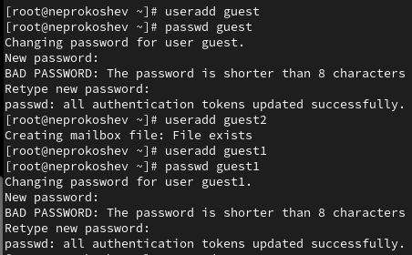
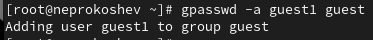
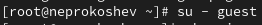
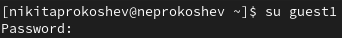
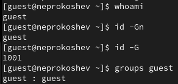
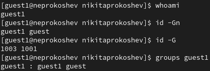
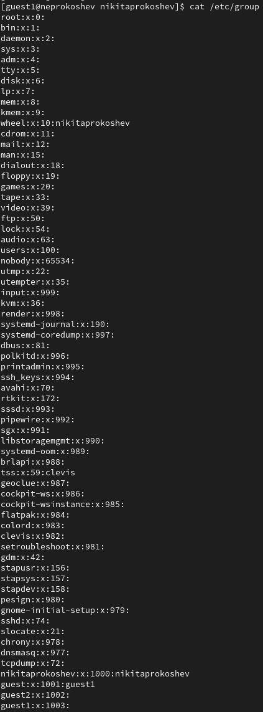
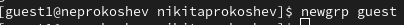
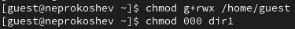

---
## Front matter
title: "Отчёт Лабораторной работы №3"
subtitle: "По дисциплине Информационная безопасность"
author: "Прокошев Никита Евгеньевич"

## Generic otions
lang: ru-RU
toc-title: "Содержание"

## Bibliography
bibliography: bib/cite.bib
csl: pandoc/csl/gost-r-7-0-5-2008-numeric.csl

## Pdf output format
toc: true # Table of contents
toc-depth: 2
lof: true # List of figures
lot: true # List of tables
fontsize: 12pt
linestretch: 1.5
papersize: a4
documentclass: scrreprt
## I18n polyglossia
polyglossia-lang:
  name: russian
  options:
	- spelling=modern
	- babelshorthands=true
polyglossia-otherlangs:
  name: english
## I18n babel
babel-lang: russian
babel-otherlangs: english
## Fonts
mainfont: PT Serif
romanfont: PT Serif
sansfont: PT Sans
monofont: PT Mono
mainfontoptions: Ligatures=TeX
romanfontoptions: Ligatures=TeX
sansfontoptions: Ligatures=TeX,Scale=MatchLowercase
monofontoptions: Scale=MatchLowercase,Scale=0.9
## Biblatex
biblatex: true
biblio-style: "gost-numeric"
biblatexoptions:
  - parentracker=true
  - backend=biber
  - hyperref=auto
  - language=auto
  - autolang=other*
  - citestyle=gost-numeric
## Pandoc-crossref LaTeX customization
figureTitle: "Рис."
tableTitle: "Таблица"
listingTitle: "Листинг"
lofTitle: "Список иллюстраций"
lotTitle: "Список таблиц"
lolTitle: "Листинги"
## Misc options
indent: true
header-includes:
  - \usepackage{indentfirst}
  - \usepackage{float} # keep figures where there are in the text
  - \floatplacement{figure}{H} # keep figures where there are in the text
---

# Цель работы

Цель: Получение практических навыков работы в консоли с атрибутами файлов для групп пользователей.

# Задание

1. Изучить теоретическую составляющую работы в консоли с атрибутами файлов для групп пользователей.
2. Реализовать работу в консоли.
3. Составить таблицу разрешённых операций.

# Выполнение лабораторной работы

1. Создаём учётные записи пользователей guest и guest1 (Рис. @pic:001).

{#pic:001 width=70%}

2. Добавляем пользователя guest1 в группу пользователей guest (Рис. @pic:002).

{#pic:002 width=70%}

3. Осуществить вход в систему от двух пользователей на двух разных консолях (Рис. @pic:003)б (Рис. @pic:004).

{#pic:003 width=70%}
{#pic:004 width=70%}

4. Уточнить имя пользователей, их группы и к каким группам они принадлежат (Рис. @pic:005), (Рис. @pic:006).

{#pic:005 width=70%}
{#pic:006 width=70%}

5. Сравнить полученную информацию с содержимым /etc/group (Рис. @pic:007).

{#pic:007 width=70%}

6. Выполнить регистрацию пользователя guest1 в группе guest (Рис. @pic:008).

{#pic:008 width=70%}

7. Изменить права на директорию /home/guest и снять с директории /home/guest/dir1 все атрибуты (Рис. @pic:009).

{#pic:009 width=70%}

# Выводы

В ходе данной лабораторной работы были получены практические навыки работы в консоли с атрибутами файлов для групп пользователей.

# Список литературы{.unnumbered}

::: {#refs}
:::
