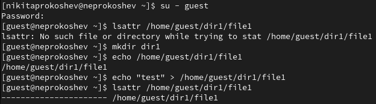
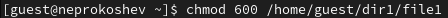
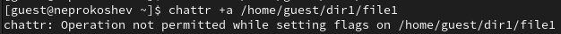
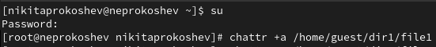
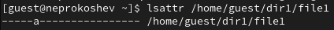
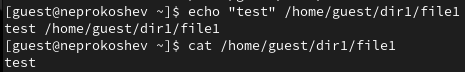
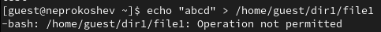
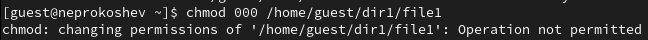
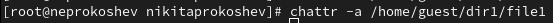
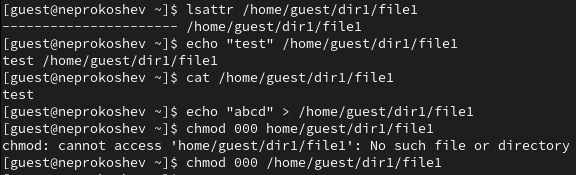

---
## Front matter
lang: ru-RU
title: Презентация Лабораторной работы №4
subtitle: По дисциплине Информационная безопасность
author:
  - Прокошев Н.Е.
institute:
  - Российский университет дружбы народов, Москва, Россия
date: 30 сентября 2023

## i18n babel
babel-lang: russian
babel-otherlangs: english

## Formatting pdf
toc: false
toc-title: Содержание
slide_level: 2
aspectratio: 169
section-titles: true
theme: metropolis
header-includes:
 - '\makeatletter'
 - '\makeatother'
---

# Информация

## Докладчик

:::::::::::::: {.columns align=center}
::: {.column width="70%"}

  * Прокошев Никита Евгеньевич
  * студент НФИбд-02-20
  * Факультет Физико-Математических и Естественных наук
  * Российский университет дружбы народов
  * [1032202460@rudn.ru](mailto:1032202460@rudn.ru)
  * <https://github.com/neprokoshev>

:::
::::::::::::::

# Вводная часть

## Цели и задачи

Цель: Получение практических навыков работы в консоли с расширенными атрибутами файлов.

Задания:
1. Изучить теоретическую составляющую работы в консоли с расширенными атрибутами файлов.
2. Реализовать работу в консоли.

# Выполнение лабораторной работы

1. От имени пользователя guest определяем расширенные атрибуты файла /home/guest/dir1/file1 (Рис. @pic:001).

{#pic:001 width=70%}

2. Устанавливаем на файл file1 права, разрешающие чтение и запись для владельца файла (Рис. @pic:002).

{#pic:002 width=70%}

3. Пробуем установить на файл /home/guest/dir1/file1 расширенный атрибут a от имени пользователя guest (Рис. @pic:003).

{#pic:003 width=70%}

4. Заходим на другую консоль с правами администратора или от имени суперпользователя и заново пробуем выполнить пункт 3 (Рис. @pic:004).

{#pic:004 width=70%}

5. От пользователя guest проверяем правильность установления атрибута (Рис. @pic:005).

{#pic:005 width=70%}

6. Выполняем дозапись в файл file1 слова "test" и читаем файл (Рис. @pic:006).

{#pic:006 width=70%}

7. Пробуем удалить файл file1 либо стереть имеющуюся в нём информацию (Рис. @pic:007).

{#pic:007 width=70%}

8. Пробуем установить на файл file1 права, запрещающие чтение и запись для владельца файла (Рис. @pic:008).

{#pic:008 width=70%}

9. Снимаем расширенный а с файла /home/guest/dir1/file1 от имени суперпользователя (Рис. @pic:009).

{#pic:009 width=70%}

10. Заново проделываем не удавшиеся действия (Рис. @pic:010).

{#pic:010 width=70%}

# Выводы

В ходе данной лабораторной работы были получены практические навыки работы в консоли с расширенными атрибутами файлов.

:::

