---
## Front matter
title: "Отчёт Лабораторной работы №5"
subtitle: "По дисциплине Информационная безопасность"
author: "Прокошев Никита Евгеньевич"

## Generic otions
lang: ru-RU
toc-title: "Содержание"

## Bibliography
bibliography: bib/cite.bib
csl: pandoc/csl/gost-r-7-0-5-2008-numeric.csl

## Pdf output format
toc: true # Table of contents
toc-depth: 2
lof: true # List of figures
lot: true # List of tables
fontsize: 12pt
linestretch: 1.5
papersize: a4
documentclass: scrreprt
## I18n polyglossia
polyglossia-lang:
  name: russian
  options:
	- spelling=modern
	- babelshorthands=true
polyglossia-otherlangs:
  name: english
## I18n babel
babel-lang: russian
babel-otherlangs: english
## Fonts
mainfont: PT Serif
romanfont: PT Serif
sansfont: PT Sans
monofont: PT Mono
mainfontoptions: Ligatures=TeX
romanfontoptions: Ligatures=TeX
sansfontoptions: Ligatures=TeX,Scale=MatchLowercase
monofontoptions: Scale=MatchLowercase,Scale=0.9
## Biblatex
biblatex: true
biblio-style: "gost-numeric"
biblatexoptions:
  - parentracker=true
  - backend=biber
  - hyperref=auto
  - language=auto
  - autolang=other*
  - citestyle=gost-numeric
## Pandoc-crossref LaTeX customization
figureTitle: "Рис."
tableTitle: "Таблица"
listingTitle: "Листинг"
lofTitle: "Список иллюстраций"
lotTitle: "Список таблиц"
lolTitle: "Листинги"
## Misc options
indent: true
header-includes:
  - \usepackage{indentfirst}
  - \usepackage{float} # keep figures where there are in the text
  - \floatplacement{figure}{H} # keep figures where there are in the text
---

# Цель работы

Цель: Изучение механизмов изменения идентификаторов, применения
SetUID- и Sticky-битов. Получение практических навыков работы в кон-
соли с дополнительными атрибутами. Рассмотрение работы механизма
смены идентификатора процессов пользователей, а также влияние бита
Sticky на запись и удаление файлов.

# Выполнение лабораторной работы

1. Входим в систему от имени пользователя guest и создаём программу simpleid.c (@pic:001, @pic:002).

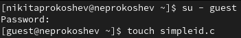{#pic:001 width=70%}
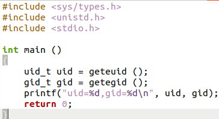{#pic:002 width=70%}

2. Скомплилируем и выполним программу simpleid.c и системную программу id и сравним полученные результаты (@pic:003).

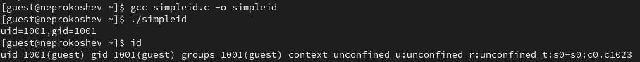{#pic:003 width=70%}

3. Усложним программу, добавив вывод действительных идентификато-
ров и назовём её simpleid2.c (@pic:004, @pic:005).

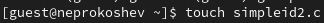{#pic:004 width=70%}
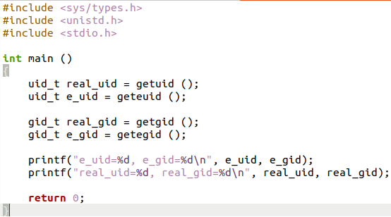{#pic:005 width=70%}

4. Скомпилируем и запустим simpleid2.c (@pic:006).

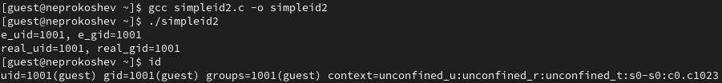{#pic:006 width=70%}

5. От имени суперпользователя выполним команды и выполним проверку правильности установки новых атрибутов и смены владельца файла simpleid2.c (@pic:007).

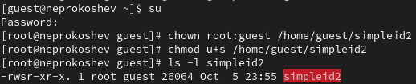{#pic:007 width=70%}

6. Запустим simpleid2.c и id и сравним результаты (@pic:008).

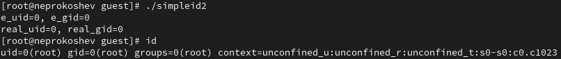{#pic:008 width=70%}

7. Создадим программу readfile.c (@pic:009, @pic:010).

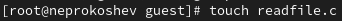{#pic:009 width=70%}
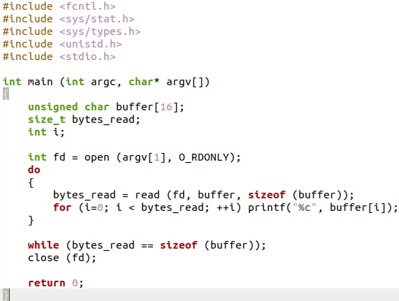{#pic:010 width=70%}

8. Скомпилируем файл readfile.c (@pic:011).

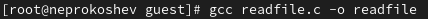{#pic:011 width=70%}

9. Сменим владельца у файла readfile.c и изменим права так, чтобы только суперпользователь (root) мог прочитать его, a guest не мог. Проверим, что пользователь guest не может прочитать файл readfile.c (@pic:012).

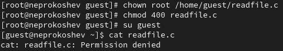{#pic:012 width=70%}

10. Сменим у программы readfile владельца и установим SetUID-бит (@pic:013). Проверим, может ли программа readfile прочитать файлы readfile.c и /etc/shadow? (@pic:014, @pic:015).

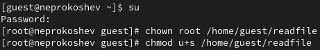{#pic:013 width=70%}
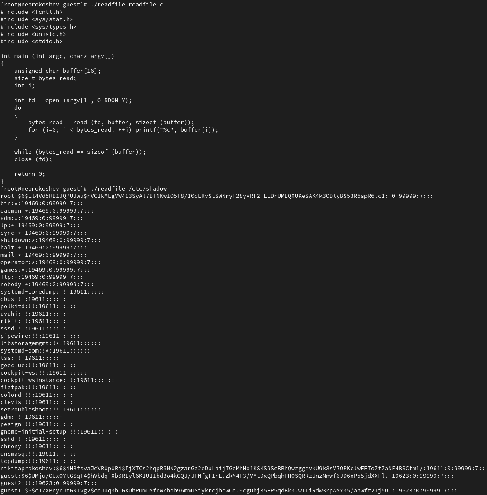{#pic:014 width=70%}
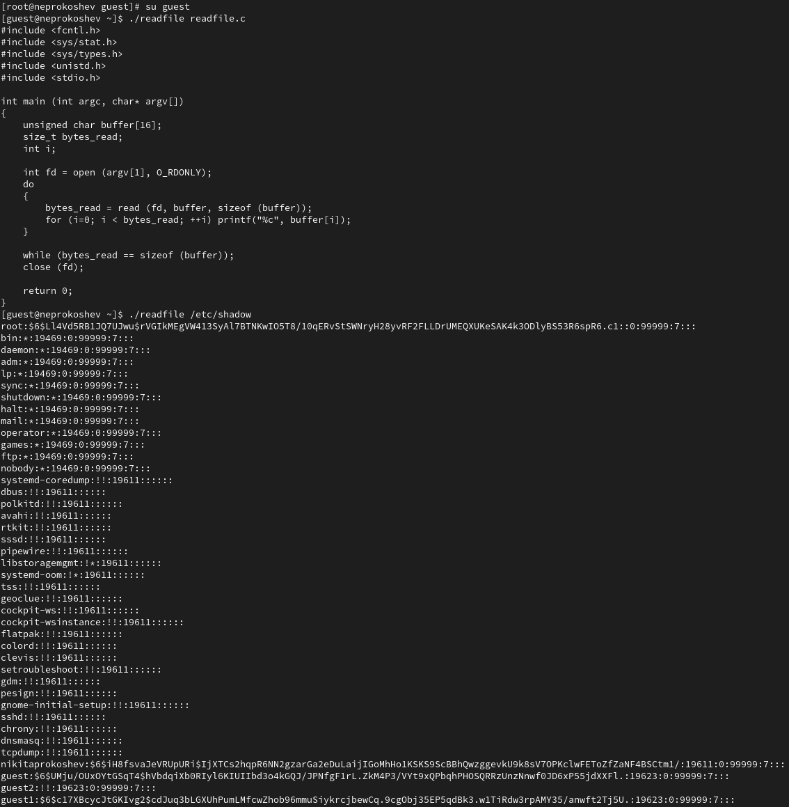{#pic:015 width=70%}

11. Выясним, установлен ли атрибут Sticky на директории /tmp (@pic:016).

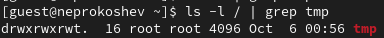{#pic:016 width=70%}

12. От имени пользователя guest создаём файл file01.txt в директории /tmp
со словом "test" (@pic:017).

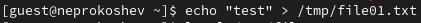{#pic:017 width=70%}

13. Просмотрим атрибуты у только что созданного файла и разрешим чте-
ние и запись для категории пользователей «все остальные». От пользователя guest1 попробуем прочитать файл file01.txt (@pic:018).

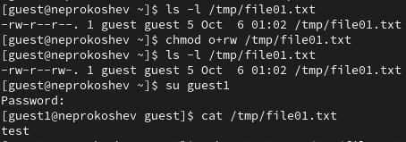{#pic:018 width=70%}

14. От пользователя guest2 попробуем дозаписать в файл /tmp/file01.txt слово "test2" и проверим содержимое файла (@pic:019).

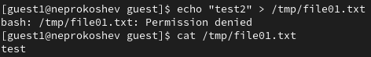{#pic:019 width=70%}

15. От пользователя guest2 попробуем записать в файл /tmp/file01.txt слово "test3", стерев при этом всю имеющуюся в файле информацию и проверим содержимое файла (@pic:020).

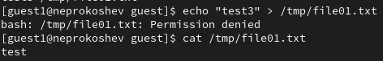{#pic:020 width=70%}

16. От пользователя guest2 попробуем удалить файл /tmp/file01.txt (@pic:021).

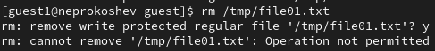{#pic:021 width=70%}

17. Повышаем свои права до суперпользователя и выполняем после этого команду, снимающую атрибут t (Sticky-бит) с директории /tmp. После покидаем режим суперпользователя (@pic:022).

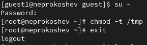{#pic:022 width=70%}

18. От пользователя guest2 проверяем, что атрибута t у директории /tmp
нет. Повторим предыдущие шаги. Видим, что теперь мы можем удалить этот файл, но не более (@pic:023).

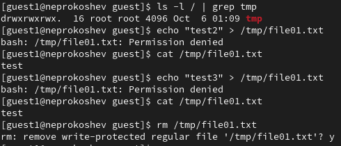{#pic:023 width=70%}

19. Повышаем свои права до суперпользователя и возвращаем атрибут t на ди-
ректорию /tmp (@pic:024).

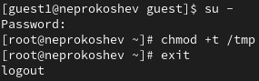{#pic:024 width=70%}

# Выводы

В ходе данной лабораторной работы были изучены механизмы изменения идентификаторов, применения SetUID- и Sticky-битов. Получены практические навыки работы в консоли с дополнительными атрибутами. Рассмотрены работы механизма смены идентификатора процессов пользователей, а также влияние бита Sticky на запись и удаление файлов.

# Список литературы{.unnumbered}

::: {#refs}
:::
