---
## Front matter
lang: ru-RU
title: Презентация Лабораторной работы №6
subtitle: По дисциплине Информационная безопасность
author:
  - Прокошев Н.Е.
institute:
  - Российский университет дружбы народов, Москва, Россия
date: 14 октября 2023

## i18n babel
babel-lang: russian
babel-otherlangs: english

## Formatting pdf
toc: false
toc-title: Содержание
slide_level: 2
aspectratio: 169
section-titles: true
theme: metropolis
header-includes:
 - '\makeatletter'
 - '\makeatother'
---

# Информация

## Докладчик

:::::::::::::: {.columns align=center}
::: {.column width="70%"}

  * Прокошев Никита Евгеньевич
  * студент НФИбд-02-20
  * Факультет Физико-Математических и Естественных наук
  * Российский университет дружбы народов
  * [1032202460@rudn.ru](mailto:1032202460@rudn.ru)
  * <https://github.com/neprokoshev>

:::
::::::::::::::

# Вводная часть

## Цели и задачи

Цель: Развить навыки администрирования ОС Linux. Получить первое прак-
тическое знакомство с технологией SELinux1.
Проверить работу SELinx на практике совместно с веб-сервером
Apache.

# Выполнение лабораторной работы

1. Войдите в систему с полученными учётными данными и убедитесь, что
SELinux работает в режиме enforcing политики targeted с помощью ко-
манд getenforce и sestatus (@pic:001).

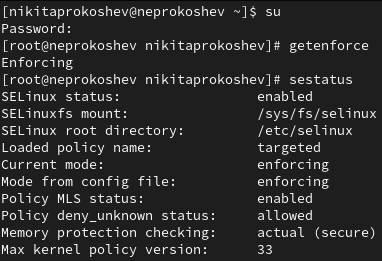{#pic:001 width=70%}

2. Посмотрите текущее состояние переключателей SELinux для Apache с
помощью команды (@pic:002).

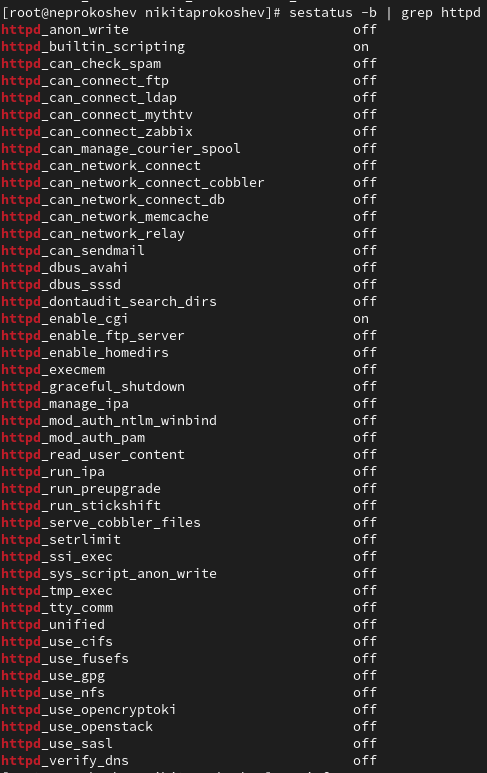{#pic:002 width=70%}

3. Посмотрите статистику по политике с помощью команды seinfo, также
определите множество пользователей, ролей, типов (@pic:003).

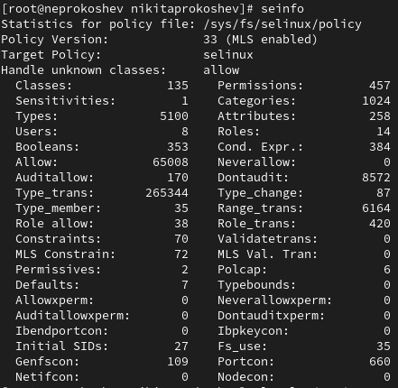{#pic:003 width=70%}

4. Oпределите тип файлов и поддиректорий, находящихся в директории/var/www, в директории /var/www/html (@pic:004).

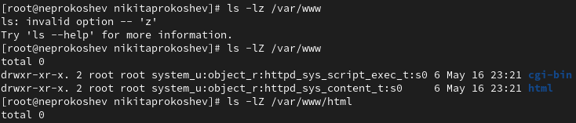{#pic:004 width=70%}

5. Создайте от имени суперпользователя (так как в дистрибутиве после установки только ему разрешена запись в директорию) html-файл /var/www/html/test.html (@pic:005) следующего содержания (@pic:006).

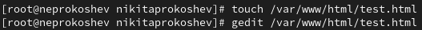{#pic:005 width=70%}
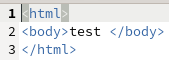{#pic:006 width=70%}

6. Проверьте контекст созданного вами файла (@pic:007).

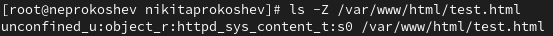{#pic:007 width=70%}

7. Измените контекст файла /var/www/html/test.html с
httpd_sys_content_t на любой другой, к которому процесс httpd не
должен иметь доступа, например, на samba_share_t (@pic:008).

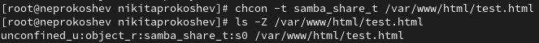{#pic:008 width=70%}

8. Попробуйте ещё раз получить доступ к файлу через веб-сервер, введя в
браузере адрес http://127.0.0.1/test.html. Вы должны получить
сообщение об ошибке.

9. Попробуйте запустить веб-сервер Apache на прослушивание ТСР-порта
81 (а не 80, как рекомендует IANA и прописано в /etc/services). Для
этого в файле /etc/httpd/httpd.conf найдите строчку Listen 80 и
замените её на Listen 81.

10. Выполните команду semanage port -a -t http_port_t -р tcp 81. После этого проверьте список портов командой semanage port -l | grep http_port_t (@pic:010).

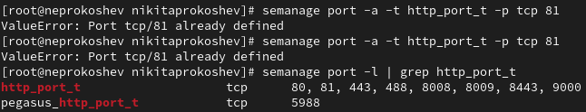{#pic:009 width=70%}

11. Верните контекст httpd_sys_cоntent__t к файлу /var/www/html/ test.html. После этого попробуйте получить доступ к файлу через веб-сервер, вве-
дя в браузере адрес http://127.0.0.1:81/test.html. Вы должны увидеть содержимое файла — слово «test». (@pic:011).

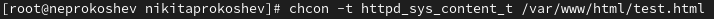{#pic:010 width=70%}

12. Исправьте обратно конфигурационный файл apache, вернув Listen 80. Удалите привязку http_port_t к 81 порту и проверьте, что порт 81 удалён. Удалите файл /var/www/html/test.html (@pic:011).

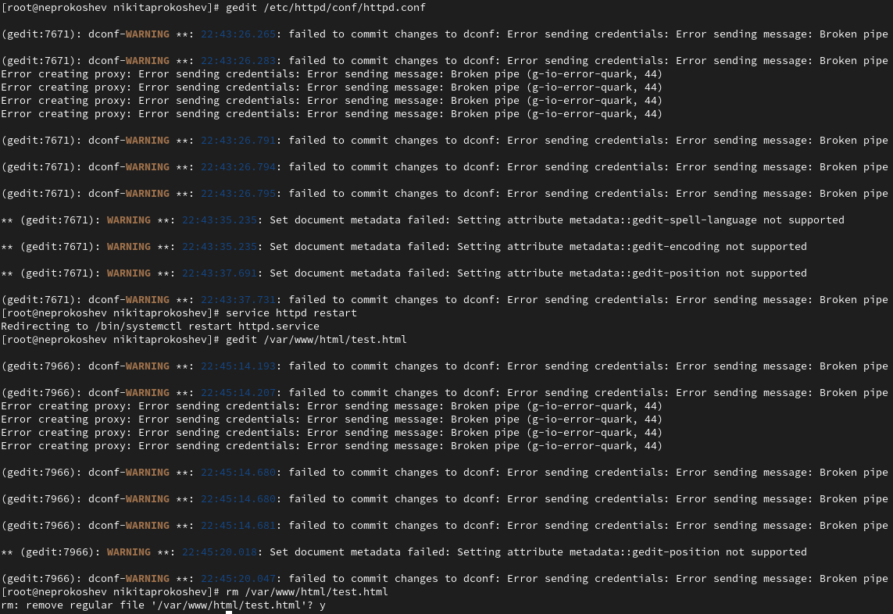{#pic:011 width=70%}

# Выводы

В ходе данной лабораторной работы удалось развить навыки администрирования ОС Linux. Получить первое практическое знакомство с технологией SELinux1.
Проверить работу SELinx на практике совместно с веб-сервером Apache.

:::

