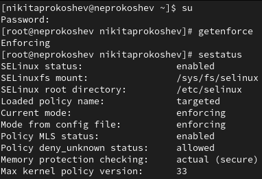
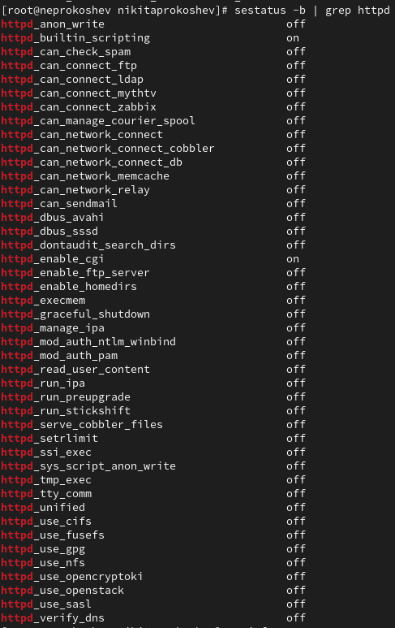
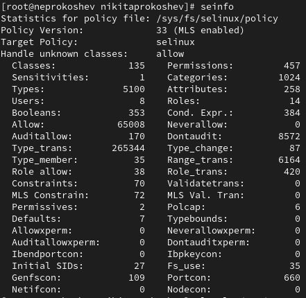
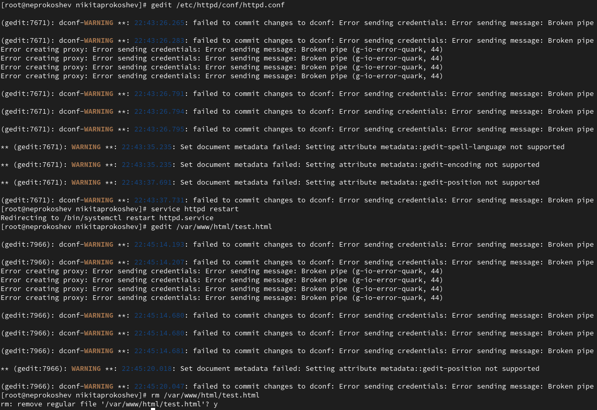

---
## Front matter
title: "Отчёт Лабораторной работы №6"
subtitle: "По дисциплине Информационная безопасность"
author: "Прокошев Никита Евгеньевич"

## Generic otions
lang: ru-RU
toc-title: "Содержание"

## Bibliography
bibliography: bib/cite.bib
csl: pandoc/csl/gost-r-7-0-5-2008-numeric.csl

## Pdf output format
toc: true # Table of contents
toc-depth: 2
lof: true # List of figures
lot: true # List of tables
fontsize: 12pt
linestretch: 1.5
papersize: a4
documentclass: scrreprt
## I18n polyglossia
polyglossia-lang:
  name: russian
  options:
	- spelling=modern
	- babelshorthands=true
polyglossia-otherlangs:
  name: english
## I18n babel
babel-lang: russian
babel-otherlangs: english
## Fonts
mainfont: PT Serif
romanfont: PT Serif
sansfont: PT Sans
monofont: PT Mono
mainfontoptions: Ligatures=TeX
romanfontoptions: Ligatures=TeX
sansfontoptions: Ligatures=TeX,Scale=MatchLowercase
monofontoptions: Scale=MatchLowercase,Scale=0.9
## Biblatex
biblatex: true
biblio-style: "gost-numeric"
biblatexoptions:
  - parentracker=true
  - backend=biber
  - hyperref=auto
  - language=auto
  - autolang=other*
  - citestyle=gost-numeric
## Pandoc-crossref LaTeX customization
figureTitle: "Рис."
tableTitle: "Таблица"
listingTitle: "Листинг"
lofTitle: "Список иллюстраций"
lotTitle: "Список таблиц"
lolTitle: "Листинги"
## Misc options
indent: true
header-includes:
  - \usepackage{indentfirst}
  - \usepackage{float} # keep figures where there are in the text
  - \floatplacement{figure}{H} # keep figures where there are in the text
---

# Цель работы

Цель: Развить навыки администрирования ОС Linux. Получить первое прак-
тическое знакомство с технологией SELinux1.
Проверить работу SELinx на практике совместно с веб-сервером
Apache.

# Выполнение лабораторной работы

1. Войдите в систему с полученными учётными данными и убедитесь, что
SELinux работает в режиме enforcing политики targeted с помощью ко-
манд getenforce и sestatus (@pic:001).

{#pic:001 width=70%}

2. Посмотрите текущее состояние переключателей SELinux для Apache с
помощью команды (@pic:002).

{#pic:002 width=70%}

3. Посмотрите статистику по политике с помощью команды seinfo, также
определите множество пользователей, ролей, типов (@pic:003).

{#pic:003 width=70%}

4. Oпределите тип файлов и поддиректорий, находящихся в директории/var/www, в директории /var/www/html (@pic:004).

{#pic:004 width=70%}

5. Создайте от имени суперпользователя (так как в дистрибутиве после установки только ему разрешена запись в директорию) html-файл /var/www/html/test.html (@pic:005) следующего содержания (@pic:006).

{#pic:005 width=70%}
{#pic:006 width=70%}

6. Проверьте контекст созданного вами файла (@pic:007).

{#pic:007 width=70%}

7. Измените контекст файла /var/www/html/test.html с
httpd_sys_content_t на любой другой, к которому процесс httpd не
должен иметь доступа, например, на samba_share_t (@pic:008).

{#pic:008 width=70%}

8. Попробуйте ещё раз получить доступ к файлу через веб-сервер, введя в
браузере адрес http://127.0.0.1/test.html. Вы должны получить
сообщение об ошибке.

9. Попробуйте запустить веб-сервер Apache на прослушивание ТСР-порта
81 (а не 80, как рекомендует IANA и прописано в /etc/services). Для
этого в файле /etc/httpd/httpd.conf найдите строчку Listen 80 и
замените её на Listen 81.

10. Выполните команду semanage port -a -t http_port_t -р tcp 81. После этого проверьте список портов командой semanage port -l | grep http_port_t (@pic:010).

{#pic:009 width=70%}

11. Верните контекст httpd_sys_cоntent__t к файлу /var/www/html/ test.html. После этого попробуйте получить доступ к файлу через веб-сервер, вве-
дя в браузере адрес http://127.0.0.1:81/test.html. Вы должны увидеть содержимое файла — слово «test». (@pic:011).

{#pic:010 width=70%}

12. Исправьте обратно конфигурационный файл apache, вернув Listen 80. Удалите привязку http_port_t к 81 порту и проверьте, что порт 81 удалён. Удалите файл /var/www/html/test.html (@pic:011).

{#pic:011 width=70%}

# Выводы

В ходе данной лабораторной работы удалось развить навыки администрирования ОС Linux. Получить первое практическое знакомство с технологией SELinux1.
Проверить работу SELinx на практике совместно с веб-сервером Apache.

# Список литературы{.unnumbered}

::: {#refs}
:::
