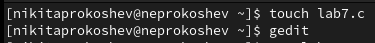
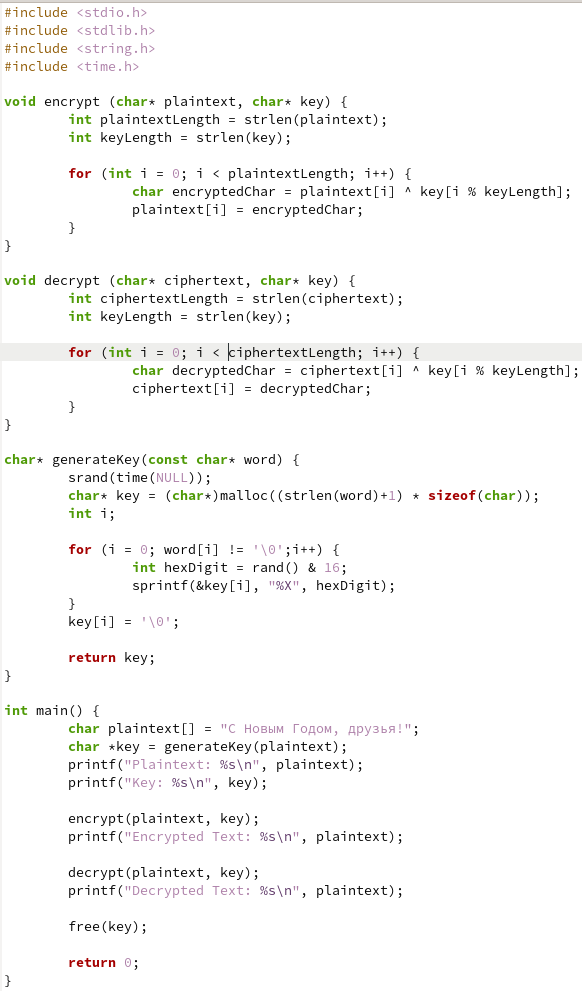
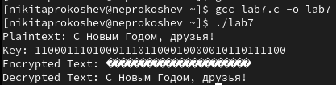

---
## Front matter
lang: ru-RU
title: Презентация Лабораторной работы №7
subtitle: По дисциплине Информационная безопасность
author:
  - Прокошев Н.Е.
institute:
  - Российский университет дружбы народов, Москва, Россия
date: 21 октября 2023

## i18n babel
babel-lang: russian
babel-otherlangs: english

## Formatting pdf
toc: false
toc-title: Содержание
slide_level: 2
aspectratio: 169
section-titles: true
theme: metropolis
header-includes:
 - '\makeatletter'
 - '\makeatother'
---

# Информация

## Докладчик

:::::::::::::: {.columns align=center}
::: {.column width="70%"}

  * Прокошев Никита Евгеньевич
  * студент НФИбд-02-20
  * Факультет Физико-Математических и Естественных наук
  * Российский университет дружбы народов
  * [1032202460@rudn.ru](mailto:1032202460@rudn.ru)
  * <https://github.com/neprokoshev>

:::
::::::::::::::

# Вводная часть

## Цели и задачи

Цель: Освоить на практике применение режима однократного гаммирования.

# Выполнение лабораторной работы

1. Создаём файл lab7.c (@pic:001).

{#pic:001 width=70%}

2. Пишем код для создания ключа, шифровки и дешифровки на языке с (@pic:002).

{#pic:002 width=70%}

3. Компилируем и запускаем программу (@pic:003).

{#pic:003 width=70%}

# Выводы

В ходе данной лабораторной работы удалось освоить на практике применение режима однократного гаммирования.

:::

